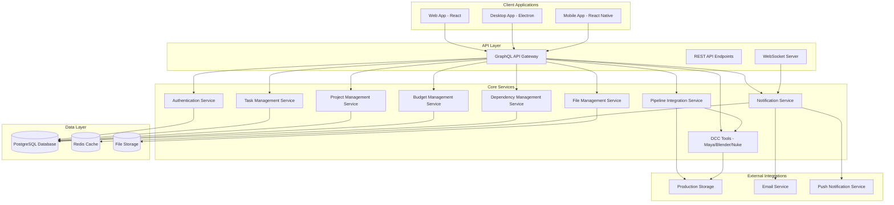

# Design Document

## Overview

The Animation Production Tracking System is designed as a modern, minimalist web application with cross-platform support (web, desktop via Electron, mobile via React Native). The system follows Linear and Notion's design philosophy of clean interfaces, task-centric workflows, and powerful functionality beneath a simple surface.

The architecture supports multiple user roles (artists, coordinators, producers, executive producers) with role-based views and permissions, while maintaining a unified experience across all platforms. The system integrates deeply with production pipelines through DCC tool integration, automated file management, and dependency tracking.

## Architecture

### High-Level System Architecture



### Frontend Architecture

The frontend follows a component-based architecture with shared design system across platforms:

- **Design System**: Unified component library with consistent styling, spacing, and interactions
- **State Management**: React Query for server state, Zustand for client state
- **Routing**: React Router for web/desktop, React Navigation for mobile
- **Real-time Updates**: WebSocket integration for live notifications and task updates
- **Offline Support**: Service workers for web, local storage for mobile

### Backend Architecture

- **API Gateway**: GraphQL for flexible data fetching, REST for file uploads
- **Microservices**: Domain-driven services for scalability and maintainability
- **Database**: PostgreSQL for relational data, Redis for caching and sessions
- **File Storage**: AWS S3 or compatible for media and production files
- **Real-time**: WebSocket server for live updates and notifications

## Components and Interfaces

### Core UI Components

#### 1. Navigation System (Linear-inspired)

**Left Sidebar Module Management**
- **Fixed left sidebar** (240px width) with module-based navigation similar to Linear
- **Top section**: Project switcher with current project name and dropdown
- **Module sections**:
  - 📋 **My Tasks** - Personal task queue and assignments
  - 📊 **Projects** - Project overview and management
  - 💬 **Comments** - Unified comment and communication center
  - 📈 **Analytics** - Reports and performance metrics
  - ⚙️ **Settings** - User preferences and project settings
- **Bottom section**: User profile, notifications, help
- **Mobile adaptation**: Collapsible drawer with same module structure

**Project Switcher (Linear-style)**
- Clean dropdown at top of sidebar showing current project
- Search functionality with keyboard navigation
- Recent projects with quick access
- Project status indicators (active, on-hold, completed)
- "Create Project" option for producers/executives

#### 2. Task Management Interface

**Main Content Area (Linear-style Layout)**
```
┌─ Left Sidebar ─┬─────────── Main Content Area ──────────────┐
│ 🎬 Project Name │ My Tasks                            [+Add] │
│                 ├─────────────────────────────────────────────┤
│ 📋 My Tasks     │ [Filter] [Sort] [View: List/Board]         │
│ 📊 Projects     ├─────────────────────────────────────────────┤
│ 💬 Comments     │ ● HIGH  ANI-001 Character Animation        │
│ 📈 Analytics    │   Walk Cycle • John Doe • Dec 15 • 💬 3    │
│ ⚙️ Settings     ├─────────────────────────────────────────────┤
│                 │ ○ MED   LIT-045 Lighting Setup             │
│ ─────────────   │   Kitchen Scene • Jane Smith • Dec 18     │
│ 👤 User Profile │ ├─────────────────────────────────────────────┤
│ 🔔 Notifications│ ○ LOW   COM-012 Composite Final            │
│ ❓ Help         │   Final Render • Mike Johnson • Dec 20     │
└─────────────────┴─────────────────────────────────────────────┘
```

**Task Board View (Kanban)**
```
┌─────────────┬─────────────┬─────────────┬─────────────┐
│   TO DO     │ IN PROGRESS │   REVIEW    │    DONE     │
├─────────────┼─────────────┼─────────────┼─────────────┤
│ [ANI-001]   │ [LIT-045]   │ [COM-012]   │ [ANI-002]   │
│ Walk Cycle  │ Kitchen     │ Final       │ Run Cycle   │
│ 👤 John     │ 👤 Jane     │ 👤 Mike     │ 👤 Sarah    │
│ ● HIGH      │ ○ MED       │ ○ LOW       │ ✅ DONE     │
└─────────────┴─────────────┴─────────────┴─────────────┘
```

**Task Detail Panel**
- **Header**: Task ID, title, status, priority, assignee
- **Metadata**: Due date, start date, estimated hours, logged time
- **Description**: Rich text with media attachments
- **Dependencies**: Upstream/downstream task relationships
- **Comments**: Threaded discussion with @mentions
- **Media Review**: Version history, approval status, feedback
- **Actions**: Status updates, time logging, file attachments

#### 3. Schedule and Timeline Views

**Timeline View (Gantt-style)**
```
Project Timeline                    Nov    Dec    Jan
┌─────────────────────────────────┬──────┬──────┬──────┐
│ Pre-Production                  │████  │      │      │
│ ├─ Storyboard                   │██    │      │      │
│ └─ Concept Art                  │  ████│      │      │
├─────────────────────────────────┼──────┼──────┼──────┤
│ Production                      │      │██████│████  │
│ ├─ Animation                    │      │████  │      │
│ ├─ Lighting                     │      │  ████│      │
│ └─ Compositing                  │      │    ██│██    │
├─────────────────────────────────┼──────┼──────┼──────┤
│ Post-Production                 │      │      │  ████│
│ └─ Final Review                 │      │      │    ██│
└─────────────────────────────────┴──────┴──────┴──────┘
```

**Calendar View**
- Monthly/weekly grid layout
- Task due dates as events
- Color coding by department/priority
- Drag-and-drop date adjustment
- Milestone markers

#### 4. Dashboard and Analytics

**Artist Dashboard**
- Personal task queue with priority sorting
- Time tracking widget
- Recent comments and notifications
- Quick actions (start task, log time, update status)

**Coordinator Dashboard**
- Team workload overview
- Department task distribution
- Upcoming deadlines
- Resource allocation charts

**Producer Dashboard**
- Project progress overview with completion percentages
- Budget vs. actual cost tracking with threshold alerts
- Department performance metrics and efficiency indicators
- Risk indicators for overdue/blocked tasks
- Time expense reports showing hours logged by artist
- Cost breakdown by department and task type
- Projected costs based on remaining work
- Budget threshold warnings and alerts

**Executive Dashboard**
- Multi-project portfolio view with status indicators
- Side-by-side cost analysis and progress comparison
- ROI and profitability metrics per project
- Resource utilization across all projects and departments
- Historical performance trends and cost analysis
- Cost per deliverable and efficiency metrics
- Exportable financial and progress reports
- Strategic decision support with capacity planning

#### 5. Communication System

**Notification Center**
- Unified inbox for all notifications
- Categorization (assignments, comments, approvals, deadlines, dependencies, budget alerts)
- Mark as read/unread functionality
- Deep links to relevant content
- Priority-based sorting and filtering
- Cross-device synchronization

**Comment System**
- Threaded conversations on tasks
- @mention functionality with notifications
- Rich text formatting
- File attachments and media previews
- Timestamped feedback for media reviews

**Real-time Updates**
- Live task status changes
- Instant comment notifications
- Collaborative editing indicators
- Presence awareness (who's viewing what)
- Dependency status updates
- Asset availability notifications
- Budget threshold alerts

#### 6. DCC Tool Integration System

**Automatic Tool Configuration**
- Task-based DCC tool selection (Maya for animation, Nuke for compositing, etc.)
- Automatic project environment setup with correct paths and settings
- Asset library access configuration
- Plugin and script loading

**File Management Integration**
- Automatic naming convention enforcement
- Directory structure validation
- Version control integration
- Asset dependency tracking
- File publishing workflow

**Production Pipeline Integration**
```
Task Creation → DCC Configuration → Environment Setup → Work Session → File Validation → Publishing
```

**DCC Tool Launcher Interface**
```
┌─────────────────────────────────────────────────────┐
│ Task: ANI-001 Character Walk Cycle                  │
│ ─────────────────────────────────────────────────── │
│ 🎬 Maya 2024 (Animation)                           │
│ 📁 /projects/demo/scenes/animation/characters/     │
│ 📦 Assets: character_rig_v003, walk_reference      │
│ ─────────────────────────────────────────────────── │
│ [Launch Maya] [Open Recent] [Browse Files]         │
└─────────────────────────────────────────────────────┘
```

#### 7. Dependency Management System

**Dependency Visualization**
- Task dependency graph showing upstream/downstream relationships
- Asset dependency tracking with version status
- Blocking issue identification and alerts
- Critical path analysis

**Dependency Status Interface**
```
┌─ Task Dependencies ─────────────────────────────────┐
│ Upstream (Required):                                │
│ ✅ MOD-001 Character Model (Complete)              │
│ ✅ RIG-001 Character Rig (Complete)                │
│ ⏳ TEX-001 Character Textures (In Progress)        │
│                                                     │
│ Downstream (Waiting):                               │
│ 🔄 LIT-001 Character Lighting                      │
│ 🔄 COM-001 Final Composite                         │
└─────────────────────────────────────────────────────┘
```

**Automatic Notifications**
- Upstream work completion alerts
- Downstream impact notifications
- Asset update availability
- Blocking issue resolution

#### 8. Budget Management System

**Cost Tracking Dashboard**
```
┌─ Project Budget Overview ───────────────────────────┐
│ Total Budget: $150,000    Spent: $89,500 (59.7%)   │
│ ████████████░░░░░░░░░░░░░░░░░░░░░░░░░░░░░░░░░░░░░░░ │
│                                                     │
│ Department Breakdown:                               │
│ Animation    $45,000 / $60,000  ████████░░          │
│ Lighting     $28,500 / $40,000  ███████░░░          │
│ Compositing  $16,000 / $30,000  █████░░░░░          │
│ Audio        $0      / $20,000  ░░░░░░░░░░          │
│                                                     │
│ ⚠️ Animation approaching 75% threshold              │
└─────────────────────────────────────────────────────┘
```

**Budget Alert System**
- Configurable threshold warnings (75%, 90%, 100%)
- Real-time cost calculation based on time entries
- Projected cost estimates based on remaining work
- Role-based alert notifications

### Linear-Inspired UI Patterns

The interface follows Linear's design principles with these key patterns:

**Module-Based Navigation**
- Left sidebar organizes functionality into clear modules (Tasks, Projects, Comments, Analytics)
- Each module has its own dedicated view and context
- Consistent navigation patterns across all modules

**Clean Task Interface**
- Minimal visual noise with essential information only
- Subtle priority indicators and status colors
- Hover states reveal additional actions
- Quick inline editing capabilities

**Command-Driven Interactions**
- Global command palette (Cmd+K) for quick actions
- Keyboard shortcuts for power users
- Quick task creation with smart defaults
- Bulk operations support

**Contextual Detail Views**
- Task details slide in from the right (preserving list context)
- Comments and media reviews in dedicated panels
- Breadcrumb navigation for deep contexts

**Consistent Visual Language**
- Monospace fonts for task IDs and technical data
- Consistent spacing and typography scale
- Subtle animations and micro-interactions
- Dark/light theme support

### Platform-Specific Adaptations

#### Web Application
- **Linear-inspired layout**: Fixed left sidebar + main content area
- **Command palette**: Cmd+K/Ctrl+K for quick navigation (Linear-style)
- **Keyboard shortcuts**: Full keyboard navigation support
- **Multi-panel views**: Task detail slides in from right (Linear-style)
- **Drag-and-drop**: File uploads and task reordering
- **Browser notifications**: Desktop notifications for updates

#### Desktop Application (Electron)
- Native menu bar integration
- System tray notifications
- File system access for DCC integration
- Offline data synchronization

#### Mobile Application
- Touch-optimized interface
- Swipe gestures for quick actions
- Camera integration for media capture
- Push notifications
- Simplified feature set focused on core workflows

## Data Models

### Core Entities

#### User
```typescript
interface User {
  id: string
  email: string
  name: string
  role: 'artist' | 'coordinator' | 'producer' | 'executive'
  department: string
  hourlyRate: number
  avatar: string
  preferences: UserPreferences
  createdAt: Date
  updatedAt: Date
}

interface UserPreferences {
  defaultView: 'list' | 'board' | 'timeline'
  notificationSettings: NotificationSettings
  themePreference: 'light' | 'dark' | 'system'
  keyboardShortcuts: boolean
  projectFilters: string[]
}
```

#### Project
```typescript
interface Project {
  id: string
  name: string
  description: string
  status: 'planning' | 'active' | 'on-hold' | 'completed'
  budget: number
  budgetCategories: BudgetCategory[]
  budgetThresholds: BudgetThreshold[]
  startDate: Date
  endDate: Date
  departments: Department[]
  members: ProjectMember[]
  settings: ProjectSettings
  dccConfiguration: DCCConfiguration
  fileNamingConventions: NamingConvention[]
  createdAt: Date
  updatedAt: Date
}

interface BudgetCategory {
  id: string
  name: string
  allocatedAmount: number
  spentAmount: number
  department?: string
}

interface BudgetThreshold {
  percentage: number
  alertLevel: 'warning' | 'critical'
  notifyRoles: string[]
}
```

#### Task
```typescript
interface Task {
  id: string
  projectId: string
  title: string
  description: string
  status: 'todo' | 'in-progress' | 'review' | 'approved' | 'done'
  priority: 'low' | 'medium' | 'high' | 'urgent'
  assigneeId: string
  creatorId: string
  department: string
  taskType: string // Used for DCC tool selection
  estimatedHours: number
  loggedHours: number
  startDate: Date
  dueDate: Date
  dependencies: TaskDependency[]
  upstreamTasks: string[] // Tasks this depends on
  downstreamTasks: string[] // Tasks that depend on this
  tags: string[]
  attachments: Attachment[]
  comments: Comment[]
  mediaReviews: MediaReview[]
  dccSettings: DCCSettings
  assetDependencies: AssetDependency[]
  isBlocked: boolean
  blockingReason?: string
  createdAt: Date
  updatedAt: Date
}

interface TaskDependency {
  id: string
  dependentTaskId: string
  dependsOnTaskId: string
  type: 'finish-to-start' | 'start-to-start' | 'finish-to-finish'
  status: 'waiting' | 'ready' | 'blocked'
}

interface AssetDependency {
  assetId: string
  assetName: string
  version: string
  status: 'available' | 'pending' | 'outdated'
  publishedAt?: Date
}
```

#### MediaReview
```typescript
interface MediaReview {
  id: string
  taskId: string
  version: number
  fileUrl: string
  status: 'pending' | 'approved' | 'needs-revision'
  reviewerId: string
  feedback: ReviewFeedback[]
  approvedAt?: Date
  createdAt: Date
}
```

#### TimeEntry
```typescript
interface TimeEntry {
  id: string
  userId: string
  taskId: string
  projectId: string
  hours: number
  description: string
  date: Date
  hourlyRate: number // Captured at time of entry for historical accuracy
  cost: number // Calculated: hours * hourlyRate
  createdAt: Date
}
```

#### DCCConfiguration
```typescript
interface DCCConfiguration {
  id: string
  projectId: string
  toolConfigs: DCCToolConfig[]
  assetPaths: AssetPath[]
  namingConventions: NamingConvention[]
  environmentVariables: Record<string, string>
}

interface DCCToolConfig {
  taskType: string
  toolName: 'maya' | 'blender' | 'nuke' | 'houdini' | 'aftereffects'
  version: string
  launchCommand: string
  projectSettings: Record<string, any>
  plugins: string[]
}

interface NamingConvention {
  pattern: string
  description: string
  example: string
  taskTypes: string[]
}
```

#### Notification
```typescript
interface Notification {
  id: string
  userId: string
  type: 'task_assigned' | 'task_updated' | 'comment_mention' | 'dependency_ready' | 'budget_alert' | 'media_review'
  title: string
  message: string
  actionUrl?: string
  isRead: boolean
  priority: 'low' | 'medium' | 'high'
  metadata: Record<string, any>
  createdAt: Date
  readAt?: Date
}
```

### Relationships

- **Users** belong to **Projects** through **ProjectMembers**
- **Tasks** belong to **Projects** and are assigned to **Users**
- **Tasks** can have **Dependencies** (upstream/downstream relationships)
- **Tasks** have **AssetDependencies** tracking required assets and versions
- **Comments** belong to **Tasks** and are created by **Users**
- **MediaReviews** belong to **Tasks** and track approval workflow
- **TimeEntries** track work logged by **Users** on **Tasks** with cost calculation
- **Notifications** are sent to **Users** based on system events
- **Projects** have **BudgetCategories** and **BudgetThresholds** for cost management
- **DCCConfigurations** define tool setups per **Project** and task type

## Error Handling

### Client-Side Error Handling

**Network Errors**
- Automatic retry with exponential backoff
- Offline mode with local data caching
- User-friendly error messages
- Graceful degradation of features

**Validation Errors**
- Real-time form validation
- Clear error messaging
- Field-level error indicators
- Prevention of invalid submissions

**Application Errors**
- Error boundaries to prevent crashes
- Fallback UI components
- Error reporting to monitoring service
- User feedback collection

### Server-Side Error Handling

**API Errors**
- Standardized error response format
- Appropriate HTTP status codes
- Detailed error messages for debugging
- Rate limiting and abuse prevention

**Database Errors**
- Connection pooling and retry logic
- Transaction rollback on failures
- Data integrity constraints
- Backup and recovery procedures

**Integration Errors**
- DCC tool connection failures
- File system access errors
- External service timeouts
- Asset dependency resolution failures
- Budget calculation errors
- Notification delivery failures
- Fallback mechanisms for all integrations

## Testing Strategy

### Frontend Testing

**Unit Tests**
- Component testing with React Testing Library
- Utility function testing
- State management testing
- 90%+ code coverage target

**Integration Tests**
- API integration testing
- User workflow testing
- Cross-component interaction testing
- Real-time feature testing

**End-to-End Tests**
- Critical user journey testing
- Cross-platform compatibility testing
- Performance testing
- Accessibility testing

### Backend Testing

**Unit Tests**
- Service layer testing
- Database model testing
- Utility function testing
- Business logic validation

**Integration Tests**
- API endpoint testing
- Database integration testing
- External service integration testing
- Authentication and authorization testing
- DCC tool integration testing
- Dependency management system testing
- Budget calculation and alert testing
- Notification delivery testing

**Performance Tests**
- Load testing for concurrent users
- Database query optimization
- API response time testing
- File upload/download performance

### Manual Testing

**Usability Testing**
- User acceptance testing with actual production teams
- Cross-platform experience validation
- Accessibility compliance testing
- Performance testing on various devices

**Security Testing**
- Authentication and authorization testing
- Data privacy compliance testing
- File access security testing
- API security testing

## Design Rationale

### Key Design Decisions

**DCC Integration Architecture**
The DCC integration system is designed as a separate service to maintain modularity and support different production pipelines. This allows for:
- Easy addition of new DCC tools without core system changes
- Pipeline-specific customization through configuration
- Isolation of tool-specific logic from the main application

**Dependency Management Approach**
The dependency system uses both task-level and asset-level tracking to provide comprehensive production flow management:
- Task dependencies handle workflow sequencing
- Asset dependencies track specific file and version requirements
- Real-time notifications ensure teams stay synchronized

**Budget Management Integration**
Budget tracking is integrated at the time entry level to provide accurate, real-time cost monitoring:
- Historical hourly rates are preserved for accurate cost calculation
- Threshold-based alerts prevent budget overruns
- Department-level tracking enables granular cost control

**Multi-Project Support Strategy**
The project switcher and unified dashboard approach balances context switching with workflow efficiency:
- Maintains user preferences per project
- Provides global search across all accessible projects
- Supports cross-project resource allocation views

**Notification System Design**
The notification system is designed to be contextual and actionable:
- Priority-based categorization reduces noise
- Deep linking enables immediate action
- Cross-device synchronization maintains continuity

This design provides a comprehensive foundation for building the animation production tracking system while maintaining the clean, minimalist aesthetic inspired by Linear and Notion. The architecture supports all the requirements while being scalable and maintainable for future enhancements. The modular service architecture allows for independent scaling and development of different system components, while the unified frontend provides a consistent user experience across all platforms.